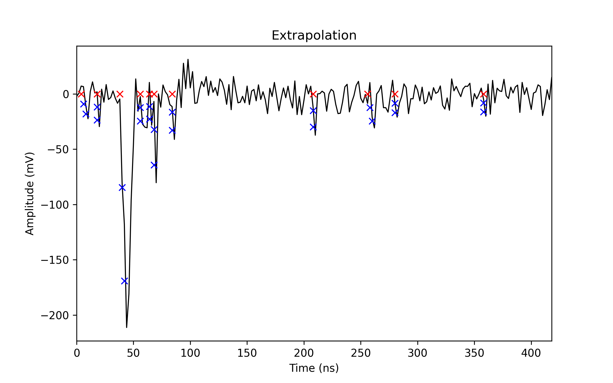

This code is known to run with Python 3.10.12

This code was originally forked from https://github.com/luanviko/regina_preprocessing

The purpose of this code is to extract quantities from the waveforms in ROOT files

### General Git Procedures

To make changes to the code, follow the procedure:
(Don't commit direct to the main, you can break the code for others)

- Clone this repository on your computer  
$   git clone https://github.com/luanviko/regina_preprocessing.git](https://github.com/HKRegina/preprocessing_wctebeam.git)

- Create a new branch to accommodate your changes (Substitute Branch_Name as you wish)  
$   git checkout -b Branch_Name  

- Make your changes (you can add new files or modify the existing ones) and ADD them to be COMMIT  
$   git add -A  

- Create a COMMIT to save your changes  
$   git commit -m "Message explaining your changes"  

- Push your modifications to the online repository  
$   git push --set-upstream origin Branch_Name  

### Useful Git commands

- Configure your Git  
$   git config --global user.name "user_name"  
$   git config --global user.email "email_id"  

- At every step you can check the status  
$   git status  

- To check local branches  
$   git branch  

- To check local and remote branches  
$   git branch -a

- To change between branches  
$   git checkout Branch_Name  

- To update your repository with the online changes  
$   git pull  

- To see all commits  
$   git log  

- To modify the time that Git saves your credentials  
$   git config --global credential.helper 'cache --timeout=7200'  

- To remove a file from commit  
$   git reset HEAD File_Name  

- To remove a commit  
$   git reset --soft HEAD~1  

- To delete a local branch  
$   git branch -d Branch_Name

- To delete an online branch  
$   git push origin --delete Branch_Name  

Reference: Pro Git book - https://git-scm.com/book/en/v2

### General Running Procedures

- You will need to install following packages:
$   sudo apt install python3-pip
$   pip3 install numpy matplotlib scipy uproot progressbar

 *** 
 
# regina_preprocessing

(Any typo is on purpose)

Basic nomenclature:
* **Baseline:** Average of N samples at the start or end of a waveform.
* **Pulse position:** Sample with pulse minimum.
* **Pulse amplitude:** Distance from pulse minimum to baseline.
* **Pulse charge:** Sum of sample amplitude times sample time over a width around pulse position.
* **Rise time:** Linear portion of pulse, the distance between 10% to 90% of pulse amplitude.
* **Pulse timing:** Sample where the pulse starts (CFD algorithm) or reaches max. amplitude (STT algorithm). 

# CFD Timing Algorithm for Multi-Pulse Analysis

Explaining the plot:
* **Blue crosses:** Start and end of rise time being considered for timing determination.
* **Red crosses:** Timing of the pulse as the extrapolated line crosses the baseline.

Basic algorithm:
* **1:** Find the position and amplitude of a pulse.
* **2:** Determine rise time.
* **3:** Walk backward from the pulse position, and find the end of rise-time.
* **4:** Continue to walk backward and find the start of rise-time.
* **5:** Find linear and angular coefficients of the line between the start and end of rise-time.
* **6:** Extrapolate this line to the baseline.
* **7:** Save the point where the extrapolated line crosses the baseline as the timing of the pulse.
